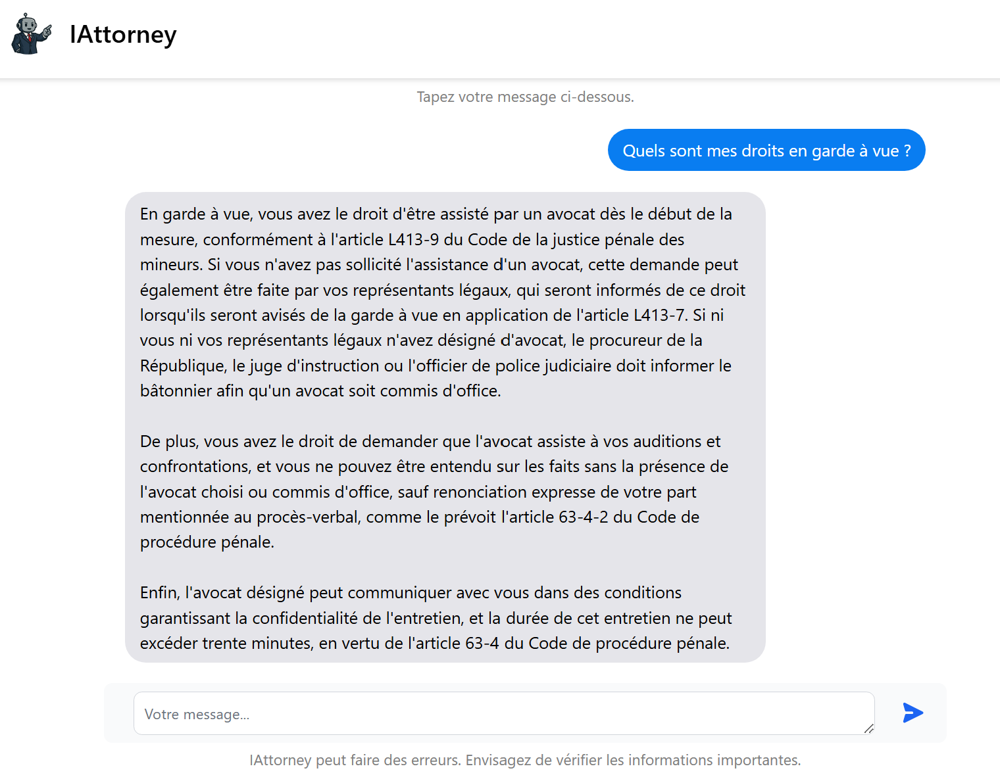

# IAttorney – French Legal RAG Assistant

IAttorney is an intelligent legal assistant built using **Flask**, **LangChain**, **FAISS**, **OpenAI**, and a RAG (Retrieval-Augmented Generation) pipeline. It provides legal answers by retrieving relevant content from a vectorized legal document base.
It is designed to help users explore and understand legal concepts, procedures, and obligations based on French legal texts.

---

### User Interface

Here's a preview of the chatbot :



---

## Project Pipeline

This project follows a structured Retrieval-Augmented Generation (RAG) pipeline tailored to **French legal data**:

### 1. Data Collection

- **Source**: The dataset used is [cold-french-law](https://huggingface.co/datasets/harvard-lil/cold-french-law), which contains articles from various French legal codes.
- **Preprocessing**: Only articles currently in force from legal codes are selected, and then enriched with metadata (e.g., code name, article number).
- **Storage**: The data is stored locally in the `data/`.

### 2. Embedding & Indexing

- **Embedding Model**: The embedding model used is [dangvantuan/sentence-camembert-base](https://huggingface.co/dangvantuan/sentence-camembert-base), which was fine-tuned with french data.
- **Vector Store**: A FAISS index is built using the vectorized articles.
- **Output**: Indexed data saved in `data/faiss_juridique_code_with_metadatas/`.

### 3. RAG Pipeline

- **Input**: User question and optionally the last interaction (used as history).
- **Decomposition**: The question is broken down into sub-questions to improve retrieval relevance.
- **HyDE (Hypothetical Document Embeddings)**: Hypothetical answers are generated to guide document search.
- **Retrieval**: Relevant legal documents are fetched from FAISS.
- **Response Generation**: The final answer is generated using OpenAI’s LLM (e.g., GPT) with the retrieved context and question.

### 4. Web Application (Flask UI)

- **Frontend**: Based on the [Autochat Bot](https://github.com/paramsgit/autochat-bot) UI template.
- **Backend**: A Flask server receives questions, runs the RAG pipeline, and returns answers.
- **History**: Only the last interaction (question + answer) is stored and used. The conversation resets on page reload for statelessness.

---

## Project Structure

```
IAttorney-RAG/
├── app.py                      # Flask web app entry point
├── config.py                   # Configuration (e.g., API keys)
├── requirements.txt            # Python dependencies
├── Dockerfile                  # Docker setup
├── .env                        # Environment variables
|
├── camembert_model/            # Embedding model
│
├── chains/                     # LangChain pipelines
│   ├── rag_chain.py            # Main RAG pipeline
│   ├── article_chain.py        # (Optional) Additional chains
│   ├── router.py               # RAG routing logic
│   ├── utils.py                # Utility functions
│
├── models/                     # Embedding model logic
│   └── embeddings.py
│
├── prompts/                    # Prompt templates
│   └── prompts.py
│
├── data/                       # Vector store & related resources
│   ├── faiss_juridique_code_with_metadatas/
│   ├── cold-french-law.pq
│   └── list_codes.py
│
├── templates/
│   └── index.html              # Frontend chat UI
│
├── static/
│   |── IAttorney_logo.png      # Logo used in the UI
│   └── screenshot.png 
│
└── README.md                   # You're here 📘
```

---

## Installation

### 1. Clone the repository
```bash
git clone https://github.com/gaeldatascience/iattorney-french-legal-rag.git
cd iattorney-french-legal-rag
```

### 2. Create and activate a virtual environment
```bash
conda create -n rag_chatbot_env python=3.10
conda activate rag_chatbot_env
```

### 3. Install dependencies
```bash
pip install -r requirements.txt
```

### 4. Run the app
```bash
python app.py
```
The chatbot will be available at [http://127.0.0.1:5000](http://127.0.0.1:5000)

### 5. Run with Docker
```bash
docker build -t iattorney .
docker run -p 5000:5000 --env-file .env iattorney
```

---

## Configuration

Create a `config.py` file with:
```python
# OpenAI API key for LLM usage
OPENAI_API_KEY=your_openai_api_key_here
# Secret key used for Flask session signing (can be any strong random string)
SECRET_KEY=your_flask_secret_key_here
# Path to the local FAISS index containing the vectorized legal documents
FAISS_PATH=data/faiss_juridique_code_with_metadatas
# Name or path of the embedding model to be used
EMBEDDING_MODEL=camembert_model
# (Optional) LangSmith tracing settings for debugging and observability
LANGSMITH_TRACING_V2=true
LANGSMITH_ENDPOINT=https://api.langchain.plus
LANGSMITH_API_KEY=your_langsmith_api_key_here
LANGSMITH_PROJECT=your_langsmith_project_name
```

Set your API keys (OpenAI, etc.) using environment variables or a `.env` file.

---

## Possible Improvements

- **Integrate Jurisprudence**: Retrieve legal precedents (e.g., from Legifrance) — currently limited by scraping restrictions.
- **Enrich Legal Sources**: Use annotated legal codes (e.g., LexisNexis, Dalloz) to provide deeper context and legal interpretations.
- **Specialized Chains**: Add dedicated LangChain chains for specific types of legal questions (e.g., definitions, procedures, penalties) to improve accuracy and relevance.
- **Answer Evaluation**: Evaluate response quality using a manually annotated dataset to measure legal correctness and completeness.

---

## Disclaimer

> **This chatbot is an educational tool and does not replace legal advice.**

---

Enjoy building with IAttorney 🧑‍⚖️
